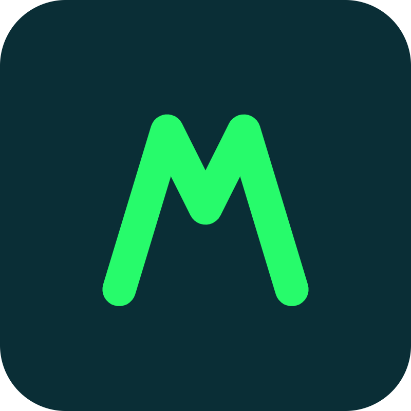
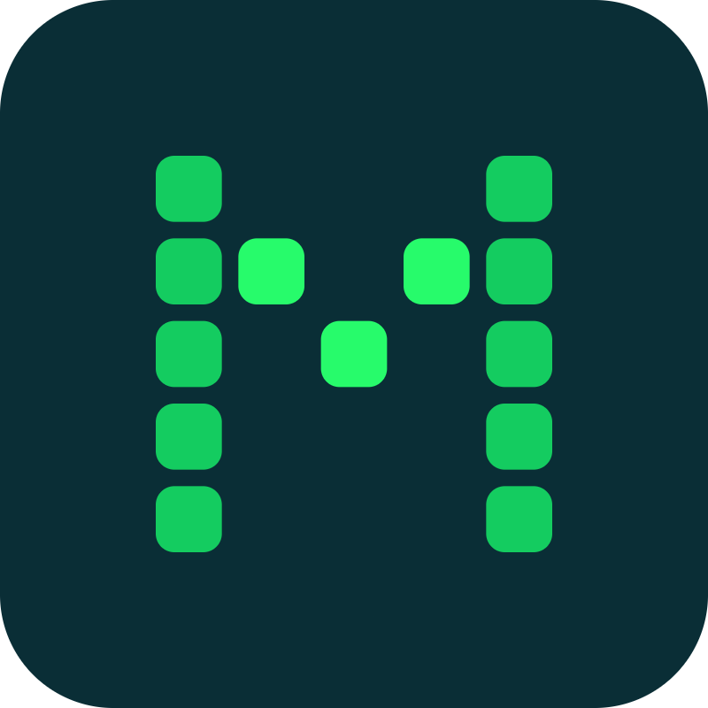
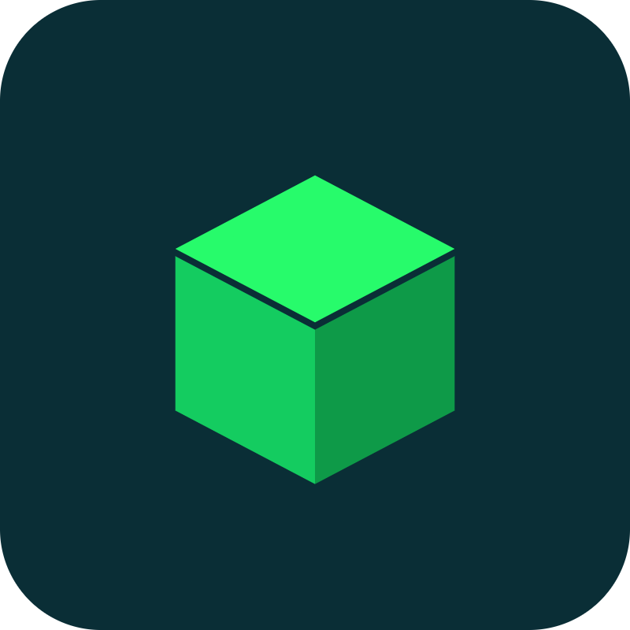
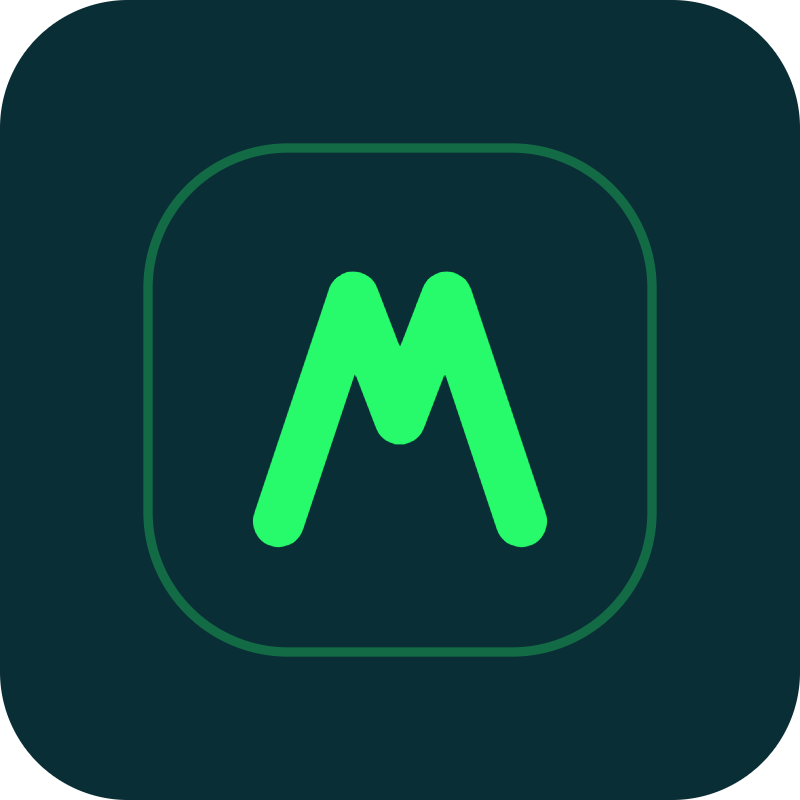
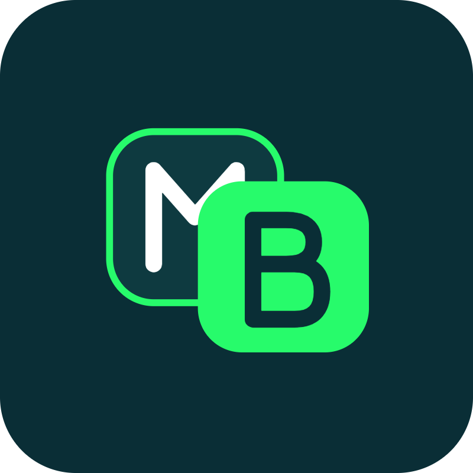
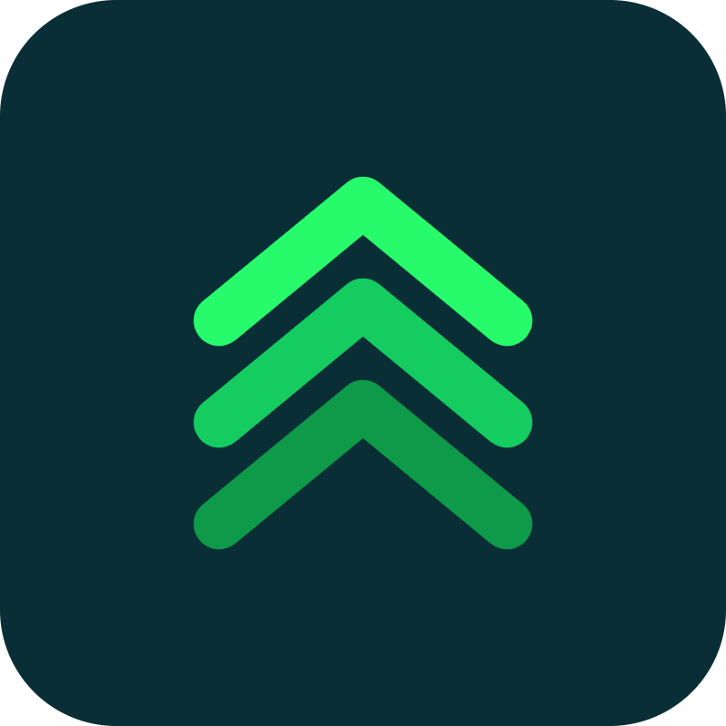
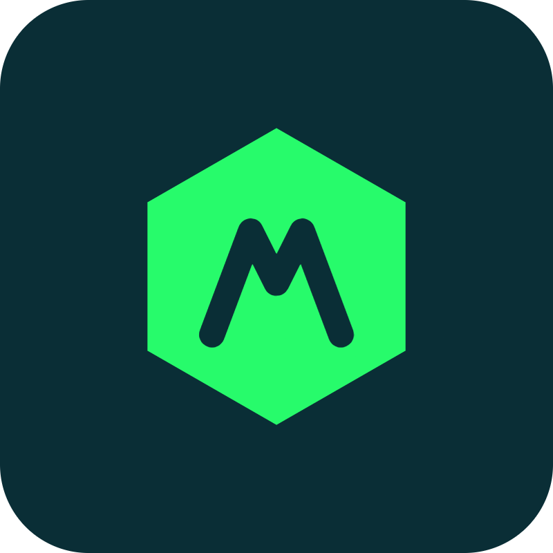
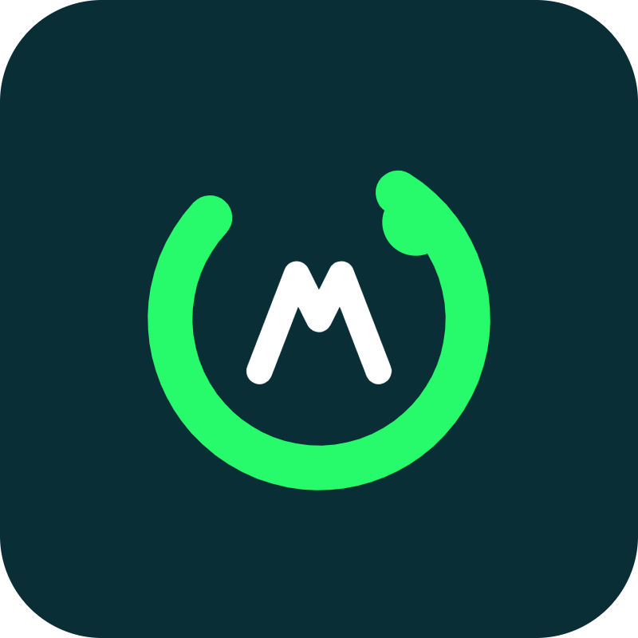

# modulBit — hlasování o logu

Vyber svůj favorit z 8 konceptů. **Hlasuj reakcí 👍 v komentáři / Discussion** u příslušného čísla, nebo napiš číslo do komentáře.

<table>
<tr><td align="center" width="50%"> <b>01 · Peak M</b></td><td align="center" width="50%"> <b>02 · Modul Grid</b></td></tr>
<tr><td align="center" width="50%"> <b>03 · Iso blok</b></td><td align="center" width="50%"> <b>04 · App ikona</b></td></tr>
<tr><td align="center" width="50%"> <b>05 · MB dlaždice</b></td><td align="center" width="50%"> <b>06 · Vrstvy</b></td></tr>
<tr><td align="center" width="50%"> <b>07 · Hex uzel</b></td><td align="center" width="50%"> <b>08 · Bit prstenec</b></td></tr>
</table>

---

### Soubory
- `png/` — náhledy na tmavé dlaždici (pro hlasování / náhled)
- `svg/` — čistý vektor, průhledné pozadí, libovolně škálovatelný (drop-in pro web, app ikonu, favicon, merch)

Barvy: Dark `#0A2E36` · Neon Green `#27FB6B` · Soft Green `#14CC60`
